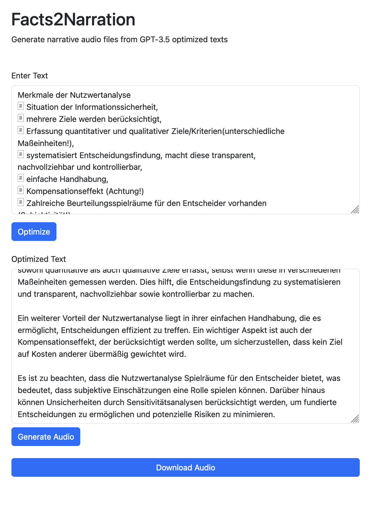

# Facts2Narration
This Flask web app allows users to optimize text and generate audio files from those optimized text.

Requirements:
- OpenAI API key
- Python3

Instructions:
- Clone the repository.
- Install dependencies `pip install -r requirements.txt`
- Run the Flask app `python app.py`
- Access the app in your browser `http://localhost:5000`

Usage:
- Paste texts from a lecture or a listing of facts into the first text area.
- Hit the "optimize" button and wait for the optimized text to appear in the second text area.
- Adjust the optimized text to prepare it for the Text-to-Speech synthesis.
- Hit the "generate audio" button and wait until the "download" button appears.
- download the created audio file and listen to it.

Adjustments:
- Voices: https://platform.openai.com/docs/guides/text-to-speech
- Optimization Prompt: adjust the system prompt string in `app.py`.
- Text length: add and adjust "max_tokens" in the function where the API gets called in `app.py`.
